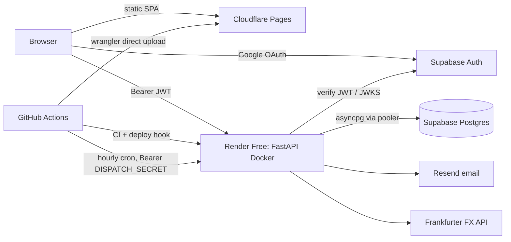

# Development Journey — GoodDaysAhead (playbook for the next project's agent)

> **Read this before you write any code.** It records how a personal-finance app (FastAPI + React + Supabase) went from a first-pass AI prototype to a branded, deliberate product on a **$0/month** stack. Use it as a playbook. Quotes from the owner are verbatim. Treat them as the taste brief.
>
> Source material in the original repo: `.skills/*.md` (phase handovers and the first architecture brief), `handoff/REBRAND-INSTRUCTIONS.md`, `HANDOFF.md` (layout and AI-slop root causes), `handover_deployment.md`, `design-review/*.html`, `_design_extract/gooddaysahead/chats/chat1.md`.

---

## 0. How the owner works (read first)

- **Brief first, then clarifying questions, then build.** The first instruction was a full architecture brief with locked decisions. Its closing line: *"ask clarifying questions where genuine ambiguity exists before producing the architecture. Do not invent requirements; surface uncertainty."*
- **Keep it simple. Don't over-engineer.** From the brief:
  > "**Elegant, not over-engineered.** This is a 1–3 user app. No microservices, no message queues, no Kubernetes. Monolithic FastAPI is correct. If you find yourself reaching for Celery or Redis, stop and justify."
- **Non-negotiables from the brief:**
  > "Pure functions for all financial math … `Decimal` everywhere money is touched — never `float` … Idempotency for any operation that could be retried … One source of truth: balance is derived from the payment ledger, never stored denormalized … Currency is always explicit."
- **Ask about design decisions instead of guessing.** In the FX audit the owner said: *"fix everything, clear with me design patterns if needed."* The agent asked three short design questions with options, got answers, then implemented. Repeat this pattern.
- **Work in phases. Write a handover at the end of each session** (`.skills/HANDOVER_PHASE_N.md`). Each handover covers status, what changed (file table), decisions, verification results, and what is still open. The next agent reads the latest handover first.
- **Fix root causes, not symptoms.** The best sessions found the one structural bug behind many visual complaints (see §1.5).

---

## 1. UI journey: from AI slop to a deliberate, branded UI

### 1.1 Timeline

| # | Stage | What it looked like | Why it changed |
|---|---|---|---|
| 1 | **"OBLIGATE" prototype** (Claude Design) | Dark zinc canvas, Swiss-style, dense metric tiles, Inter + JetBrains Mono, emerald/amber | Too much like an analytics dashboard for checking bills every day |
| 2 | **Splitwise-inspired pivot** | Light background, green `#22c55e`, grey secondary, white cards, mobile-first. Paired `Obligate Mobile.html` and `Obligate Desktop.html` mockups | Owner feedback (below) |
| 3 | **UI Overhaul** (`.skills/HANDOVER_UI_OVERHAUL.md`) | Mockups ported into React/Tailwind tokens. Sidebar with grouped bills. Add-obligation became a modal. Tabs on detail page | Make the real app match the design source |
| 4 | **IA correction** (`.skills/handover_pre_deployment.md`) | Nav set to Home / Bills / Insights / Tracker / Reminders / Settings. Simulator moved into Insights. Tracker became top-level | Owner corrected the navigation structure |
| 5 | **Rebrand to GoodDaysAhead** (`handoff/REBRAND-INSTRUCTIONS.md`) | Warm paper, horizon teal, dawn orange accent, Bricolage Grotesque display face, sun-over-horizon mark | Generic green fintech has no identity |
| 6 | **Design review: "Eradicating AI-slop"** (`design-review/`) | Custom 41-glyph icon set replaced lucide-react. Sidebar active state became a dawn→horizon "sunrise" | Borrowed components were "doing the talking" |
| 7 | **Root-cause polish** (`HANDOFF.md`) | Sticky fix, threshold-free grid, contrast-safe `ink-3`, flat tables instead of stacked cards, colour used for annotation | The UI still *felt* sloppy. The causes turned out to be structural |

### 1.2 The owner's prompts that drove it (verbatim)

First prompt to the design tool:
> "Show me what everything and html and rendered one for this loan repayment app. Only the UI part."

The pivot. This is the core taste signal, so keep it in mind on every project:
> "- UI: Splitwise-inspired — light background, green primary, grey secondary, white cards, mobile-first
> - Now it's too dashboard like and not ez for day to day use.
> - no backend bullshits."

Lesson: **design for how often the owner uses each screen, not for how much data fits on it.** An app checked every day needs a checklist feel, not an analytics cockpit.

The owner's design-agent skill (`.skills/ui_designer.md`). Copy it into the new project. Key lines:
> "aggressively penalize and avoid highly generic 'AI slop' patterns—such as defaulting to purple gradients over white cards, standard centered hero text, or unmodified stock components … Ask yourself: 'Is this a custom decision, or am I falling back on what is statistically most common?'"
>
> "Design Quality and Originality are weighted the heaviest."
>
> "**Always clear with users about the application.** Different application has different requirements & complexity. Some need fancy UI, some need functionally obvious UI, and some need visually appealing dashboard like. You will need to always provide options to user and clear requirements."

The grading criteria in that skill are **Design Quality (coherence and mood), Originality, Craft, and Functionality**. It works as a loop: a generator agent builds, an evaluator agent with Playwright MCP screenshots and critiques, and the generator then decides to **refine** (scores improving) or **pivot** (generic or plateaued).

### 1.3 What "AI slop" meant concretely (from `design-review/Design Review - Eradicating AI-slop.html`)

> "The shell is functional. It just isn't yours yet. … What still reads as generic AI scaffolding is the chrome around it: an off-the-shelf icon set and a stock-SaaS sidebar that any template ships with."

The four tells:
1. **Stock icon set.** lucide-react is *"the single most common icon library in AI-generated React apps, so a trained eye clocks it instantly."*
2. **Stock sidebar anatomy.** The brand appeared only in the 32px logo, *"then never appears again."*
3. **Generic metaphors.** A Zap bolt for variable bills and a Landmark for loans. The replacements were a fluctuating **wave** for variable bills, a line **rising over a horizon** for insights, **sliders** instead of a gear for settings, and an **arch** echoing the sunrise for loans.
4. **Motif used once, then dropped.** *"A real brand repeats its core gesture — in dividers, active states, empty states, loaders — with restraint."*

Further slop found later in `HANDOFF.md`:
- **Grey micro-text everywhere.** `ink-3 #93999a` measured **2.89:1** contrast and was used as text in 155 places, so the eye read it as filler. Changing one token to `#697068` (5.10:1) fixed all 155.
- **Nested cards.** Card → tinted box → card, three borders deep to show one exchange rate.
- **Repeated copy.** "Fixed bill" under every row when the chip already showed the type. Instruction paragraphs explaining affordances the rows already had. Capability boasts like "Up to 365 days ahead".
- **Segmented controls that wrap.** A five-button sort bar became one native `<select>`.
- **One card per item.** Six bordered loan cards took three screens. One table with five shared columns fit everything above the fold.

### 1.4 Brand system (the result)

| Token | Value | Use |
|---|---|---|
| `paper` / `bg` | `#F6F1E6` | App background (warm, never cool grey) |
| `card` | `#FFFFFF` | Surfaces |
| `cream` | `#FBF4E8` | Logo container only |
| `line` / `line-soft` | `#ECE7DA` / `#F3EFE3` | Hairlines |
| `ink` / `ink-2` / `ink-3` | `#1A1D1A` / `#5F6660` / **`#697068`** | Text. `ink-3` must stay ≥ 4.5:1 |
| `primary` / `-ink` / `-soft` | `#1CC29F` / `#0F8A6F` / `#E3F5EE` | Horizon teal: CTAs, active state, focus ring |
| `dawn` / `-ink` / `-soft` | `#FF8A5C` / `#C8451F` / `#FFF4E8` | **Only** the "Days" in the wordmark and payoff/celebration moments |
| `sky` / `-soft` | `#6B9FFF` / `#ECF2FF` | Loans, info |
| `warn` / `danger` | `#FF8A3D` / `#F55A4E` | Real state only |

- **Type:** Bricolage Grotesque for display (h1–h3, hero numbers, modal titles, wordmark) at `-0.02em` tracking, `-0.025em` on the hero amount. System/Inter for UI text. JetBrains Mono + `tabular-nums` for money and dates in tables.
- **Wordmark:** always rendered by one component, `<Wordmark/>` → `Good<span class="text-dawn">Days</span>Ahead`. Never hardcode the name.
- **Gradients:** `grad-horizon`, `grad-sun`, `grad-dawn-horizon`. Used only on the hero and on celebrations.
- **Chart palette is locked:** `['#1cc29f','#6b9fff','#ff8a5c','#0f8a6f','#ffc987']`. Charts read tokens through a `token()` helper and never copy hex values.
- **Icons:** own `<Icon name="…"/>` component. 24-grid, 1.8px round stroke, `currentColor`, 41 glyphs, `spin` prop for loaders. Then `npm rm lucide-react`.
- **Sidebar "sunrise":** the active item gets a cream→teal wash plus a 3px dawn→horizon bar on the left. The brand header gets a dawn fade closed by a 2px dawn→teal rule. The avatar uses the dawn gradient.

### 1.5 Design rules to carry forward

1. **Use colour for annotation, not grey text.** Type goes in a tinted chip (loan=sky, fixed=primary, variable=dawn, one-off=cream). Urgency goes in text colour: overdue/today = danger, ≤7 days = warn, otherwise ink-2. *"Colouring everything would mean colouring nothing."*
2. **Every text colour passes AA (4.5:1) on every surface.** Measure it. Don't eyeball it.
3. **No nested cards.** Use one titled card with hairline-separated rows: label and explanation on the left, control on the right.
4. **One rhythm per page.** One card, one table, shared columns, single-line rows. Add a second line only when it adds information.
5. **One dropdown everywhere.** A native `<select>` styled with brand tokens: touch gets the OS picker, and there's no popover to escape a scroll container.
6. **Hover, tap and keyboard focus drive one state,** so a row can't end up half-open.
7. **Don't repeat facts.** If the chip shows it, the subtitle shouldn't. Remove instruction paragraphs and capability boasts.
8. **Give each fact one source.** `lib/due.ts` owns "days until due" for every page. Two pages showing the same loan must read the same number from the same endpoint.
9. **Before the rebrand counts as done,** this grep finds nothing outside the token files: `grep -E "#[0-9a-fA-F]{3,6}|gray-|green-|red-|blue-|primary-[0-9]" src`.

### 1.6 Layout root causes (the most reusable lesson)

From `HANDOFF.md`:

1. **`overflow-x: hidden` on `html, body` breaks every `position: sticky`.** Per the CSS spec it promotes `overflow-y` to `auto`, which turns `<body>` into a scroll container that never scrolls. **Use `overflow-x: clip`.**
2. **Layouts that change behaviour at a threshold.** `mx-auto max-w-[1500px]` pulled the sidebar off the window edge on wide screens. A centred `max-w` content column left a 611px void at 2994px. **Fix: one rule at every width.** A CSS grid whose tracks are declared once:
   ```css
   :root {
     --app-sidebar-w: 260px;
     --app-gutter: clamp(1rem, 0.6rem + 1.2vw, 3.5rem);
     --app-bottom-gap: 7rem;   /* 3.75rem from md up */
   }
   ```
   ```jsx
   <div className="grid md:grid-cols-[var(--app-sidebar-w)_minmax(0,1fr)]">
     <aside className="sticky top-0 hidden h-screen md:block" />
     <main><div className="w-full px-[var(--app-gutter)]">…</div></main>
   </div>
   ```
   No `max-width`, no `mx-auto`. `minmax(0,1fr)` stops wide tables from forcing horizontal overflow.
3. **Low-contrast tertiary ink.** See §1.3.

### 1.7 Mobile vs desktop

The same React SPA is rendered responsively, with the same Supabase session, API and database. Sync works by refetching, not in realtime: TanStack Query uses a low `staleTime` plus refetch on focus and reconnect, and the Tracker refetches every 30s.

| Concern | Mobile (< `md` 768px) | Desktop (≥ `md`) |
|---|---|---|
| Navigation | Fixed `BottomNav` with 6 tabs, `pb-safe` for the notch, 2px top bar on the active tab | Sticky 260px `Sidebar` welded to the left edge, plus a loans quick list with balances |
| Bottom clearance | `--app-bottom-gap: 7rem` | `3.75rem` |
| Touch | `@media (pointer: coarse) { button, a, [role=button] { min-height:44px; min-width:44px } }` | Hover reveals secondary actions such as "Mark paid", in reserved width so nothing shifts |
| Viewport | `viewport-fit=cover`, `env(safe-area-inset-bottom)` | — |
| Pickers | Native `<select>` → OS picker | Same component |
| Dense data | Calendar and list stack, panels keep a stable min-height | Side-by-side panels, 5-column tables |
| Gutter | `clamp()` scales continuously, with no jumps | Same rule |

### 1.8 How the UI was tested and improved

- **Playwright E2E** (`frontend/playwright.config.ts`): three projects.
  - `setup` does one manual Google login (3-minute timeout) and saves storage state to `.auth/user.json`. It reuses the state while it's under 50 minutes old, and launches with `--disable-blink-features=AutomationControlled` so Google allows the login.
  - `chromium` covers desktop. `mobile` uses **`Pixel 5`**: `iPhone 13` + `channel: 'chrome'` crashed on Windows.
  - Results: 18 + 18 passing, 37 after the Tracker work.
- **Locator lessons:**
  - Scope to `main …`, because hidden sidebar links match first on mobile.
  - Use `getByRole('heading', { name })` instead of `getByText`, which hits strict-mode violations.
  - Use `button:has-text("Loan")` so the "Loans" section header doesn't match.
- **Lighthouse:** desktop scored 100/100/100/100 and mobile 92/100/100/100. Fixes were contrast on the ToS text and adding `robots.txt`.
- **Layout verification by measurement, not screenshots.** Check `aside.getBoundingClientRect().left === 0`, check that the content gap equals the computed gutter, and check for horizontal overflow at 421 / 684 / 768 / 1400 / 1644 / 1944 / 2594 / 4794px.
- **Pitfall:** Playwright `browser_resize` pins the viewport, and the pin survives closing the page. The canvas past the document then paints white, which looks like a layout bug. The tell is `window.innerWidth > window.outerWidth`. Verify in a browser you haven't resized.
- **Each UI session ends with** `tsc -b`, `vite build` and the backend tests green, plus a handover listing what's still open.

---

## 2. Hosting, deployment and CI/CD ($0 stack)

### 2.1 Architecture



| Layer | Service | Free-tier facts that shaped the design |
|---|---|---|
| Frontend | Cloudflare Pages, **direct upload via Wrangler from Actions** (not Git-connected builds) | `public/_redirects` → `/* /index.html 200` for SPA routes |
| Backend | Render Free Web Service, **Docker** (`backend/Dockerfile.render`), Singapore | Sleeps after ~15 min idle, cold start ~30–60s, 750 instance-hours/month |
| DB + Auth | Supabase Free (Postgres + Google OAuth) | 500 MB DB. **Project pauses after ~7 days without activity** |
| Email | Resend Free | ~100/day, 3,000/month. Needs a verified sending domain |
| Cron | GitHub Actions scheduled workflow | Replaces a paid cron/worker. Wakes the sleeping backend |
| FX | Frankfurter (`api.frankfurter.dev/v1`) | No key. Cached in the DB |

Check the free-tier numbers again when you sign up. Providers change them.

### 2.2 Accounts, credentials and keys to create

| Provider | Create | Store where | Name |
|---|---|---|---|
| GitHub | Repo. Fine-grained PAT (only if an agent will drive `gh`) | Local `.env` only | `GITHUB_PAT` |
| Supabase | Project (pick the region nearest the backend: ap-southeast-1 to match Render Singapore) | Render env + GitHub secrets | `SUPABASE_URL`, `ANON_KEY`, `SERVICE_ROLE_KEY`, `JWT_SECRET`, `DATABASE_URL` (pooler URL) |
| Google Cloud | OAuth client (Web). Consent screen External, Testing → Production | Supabase → Auth → Providers → Google | `GOOGLE_CLIENT_ID`, `GOOGLE_CLIENT_SECRET` |
| Render | Free web service from GitHub repo, **Docker** | Render dashboard env vars | see §2.4. Deploy hook URL → GitHub `production` environment secret `RENDER_DEPLOY_HOOK_URL` |
| Cloudflare | Pages project (`wrangler`/API) + API token with **account-level Cloudflare Pages:Edit** | GitHub secrets | `CLOUDFLARE_API_TOKEN`, `CLOUDFLARE_ACCOUNT_ID`, `CLOUDFLARE_PROJECT_NAME` |
| Resend | Account, API key, verified domain (DNS records) | Render env | `RESEND_API_KEY`, `RESEND_FROM_EMAIL="App <reminders@your-domain>"` |
| Self-generated | Long random string | Render env **and** GitHub secret (same value) | `DISPATCH_SECRET` |

**GitHub Actions secrets:** `VITE_SUPABASE_URL`, `VITE_SUPABASE_ANON_KEY`, `VITE_API_URL`, `API_BASE_URL`, `DISPATCH_SECRET`, `CLOUDFLARE_API_TOKEN`, `CLOUDFLARE_ACCOUNT_ID`, `CLOUDFLARE_PROJECT_NAME`.
**GitHub `production` environment secret:** `RENDER_DEPLOY_HOOK_URL`.
**GitHub variable:** `CLOUD_DEPLOY_ENABLED=true`. This is a kill switch: push-deploys run only when it's `true`.

### 2.3 Workflows (`.github/workflows/`)

| File | Trigger | Does |
|---|---|---|
| `ci.yml` | PR + push to `main` | Backend: Python 3.12, **Postgres 16 service container**, `alembic upgrade head`, `pytest`. Frontend: Node 22, `npm ci && npm run build` |
| `deploy-backend-render.yml` | push to `main` on `backend/**`, `render.yaml`; manual | Re-runs migrations + tests, then `curl -X POST $RENDER_DEPLOY_HOOK_URL`. `concurrency: render-backend-production, cancel-in-progress: true`. Guarded by `CLOUD_DEPLOY_ENABLED` |
| `deploy-frontend-cloudflare.yml` | push to `main` on `frontend/**`; manual | Builds with `VITE_*` (fails if any is missing), `cloudflare/wrangler-action@v3` deploy of `frontend/dist`. Same concurrency + guard |
| `dispatch-reminders.yml` | `cron: '0 * * * *'` + manual | Validates secrets, warms `/health` (6 retries × 20s for cold start), `POST /internal/dispatch-reminders` with Bearer `DISPATCH_SECRET` (3 retries), prints non-secret status/body. `cancel-in-progress: false`, `timeout-minutes: 20` |

Render setting: **Auto-Deploy = "After CI Checks Pass"**. The hook gives an explicit deploy after validation.

### 2.4 Render specifics and gotchas

- Docker build context is `backend`, the Dockerfile path is `backend/Dockerfile.render`, and the paths use **forward slashes** (Render rejects backslashes). Don't use the dev `backend/Dockerfile`, which has `--reload`.
- Start script `backend/scripts/render-start.sh`:
  ```sh
  # retries `alembic upgrade head` 5× / 10s (DB may be waking), then:
  exec uvicorn app.main:app --host "$HOST" --port "${PORT:-8000}"
  ```
- Env vars: `DATABASE_URL, JWT_SECRET, SUPABASE_URL, ANON_KEY, SERVICE_ROLE_KEY, RESEND_API_KEY, RESEND_FROM_EMAIL, DISPATCH_SECRET, DEBUG=false, CORS_ORIGINS=https://<app>.pages.dev`.
- `render.yaml` documents the intended setup, but a dashboard-created service **doesn't sync env changes from it**. Set them in the dashboard.
- Smoke test after deploy:
  - `GET /health` returns 200.
  - The Pages URL returns 200.
  - **CORS preflight** from the Pages origin returns 200 with the right `Access-Control-Allow-Origin`.
  - Run a manual dispatch with the workflow (`{"sent":0,"skipped":0,"failed":0}` is a pass).

### 2.5 Supabase Auth URL config (the bug that blocked production login)

Symptom: after Google sign-in on production, the browser landed on `http://localhost:3000/#access_token=…`. Cause: Supabase **Site URL** was still localhost.

- **Supabase → Authentication → URL Configuration:**
  - Site URL: `https://<app>.pages.dev`.
  - Redirect URLs: the prod URL, `http://localhost:3000`, and `http://127.0.0.1:3000` (add `/**` variants for dev and previews).
- **Google Cloud OAuth client:**
  - JS origins: the same three.
  - Authorized redirect URI: `https://<project-ref>.supabase.co/auth/v1/callback`.
- **Frontend:** `signInWithOAuth({ provider: 'google', options: { redirectTo: window.location.origin } })`.
- Supabase's "OAuth Server" page is for making Supabase an identity provider for other apps. You don't need it.
- Keep Google scopes to `openid email profile` to avoid Google's verification review. While the consent screen is in Testing, only listed test users can sign in.
- **Never paste callback URLs containing `access_token` or `provider_token` into chat or logs.**

### 2.6 Cost-limiting and abuse guardrails

**Implemented in code:**
- `/internal/dispatch-reminders` requires `Authorization: Bearer DISPATCH_SECRET`, so nobody else can trigger email sends.
- Dispatch is **idempotent**: there's a dispatch log keyed on (rule, due date), so retries and overlapping crons can't double-send.
- Input caps (Pydantic): reminder lead time 0–365 days, tracker `months` 1–24, export `months` 1–120, tenor ≤ 600, APR 0–2, amounts `> 0`, 3-letter currency codes.
- FX: 8s timeout, 1 retry, 7-business-day look-back, **DB cache** with a unique `(base, quote, date)` index, plus a per-request rate memo. `follow_redirects=True`, because Frankfurter's host move once broke every fetch with silent 301s.
- CORS allowlist from `CORS_ORIGINS`. Not `*`.
- Deploy kill switch (`CLOUD_DEPLOY_ENABLED`). Concurrency groups cancel stale deploys.
- Startup migration retry with a bounded number of attempts.

**Not implemented here. Add these in the next project:**
- [ ] Rate limiting (e.g. `slowapi`) on authenticated and public routes. Stricter limits on export and FX-fetch routes.
- [ ] **Per-user and global daily email cap** below Resend's free quota. Skip and log when exceeded.
- [ ] **Postgres RLS** on every table (`user_id = auth.uid()`). The brief asked for it, but the build relied only on backend `user_id` filtering. Defence in depth matters if the anon key is ever used against PostgREST. Supabase exposes tables in `public` through the Data API by default.
- [ ] Pagination on list endpoints.
- [ ] Request body size limit.
- [ ] Optional email allowlist for sign-ups while in personal or beta mode.

**Cloud-side guardrails:**
- **Supabase:** stay on the Free plan (no billing, so there are hard caps instead of overage). If you upgrade later, keep the **Spend Cap ON**. Watch the 7-day inactivity pause: the hourly cron hitting the DB counts as activity.
- **Render:** keep the instance type Free with autoscaling off. Check that no paid add-ons such as disks or a paid Postgres were selected.
- **GitHub Actions:** hourly cron × warm-up retries uses minutes. Free is unlimited for **public** repos and 2,000 min/month for private ones. On a private repo, estimate `24 × 30 × avg_minutes` and lower the cron frequency if needed. Set `timeout-minutes` on every job.
- **Cloudflare:** direct uploads don't count against Pages build minutes. Scope the API token to one account and Pages only.
- **Resend:** use a verified domain. Free quota is the hard ceiling, so add the code-level cap above.
- **Secrets hygiene:** `.env` lives at the repo root, is gitignored, and is never printed. Rotate the PAT, service-role key, DB password, Google secret, Resend key and Cloudflare token after any exposure. Read the PAT into `$env:GH_TOKEN` from `.env` without echoing it.

### 2.7 Local dev

- `.env` at the repo root. `backend/app/config.py` resolves it with `Path(__file__).parents[2] / ".env"` and `extra="ignore"`.
- `start.bat` launches the backend (`uvicorn` on 8000) and the frontend (Vite on 3000).
- `docker-compose.yml` runs a local Postgres 16.
- Gotchas:
  - PowerShell caches stale env vars, so run `$env:DATABASE_URL = ""` first.
  - `uvicorn --reload` was unreliable on Windows, so restart manually.
  - Run `pip install -r requirements.txt` after time away, because the venv drifts.
  - Use the project venv for pytest. Global Python lacked the dependencies.
  - Avoid `gh run watch` in the VS Code terminal (it opens an alternate screen). Poll the REST status instead.

---

## 3. Supabase and database

- **Supabase is used for Auth (Google) and Postgres only.** The frontend never queries tables directly. All data goes through FastAPI, and Supabase JS is used only for the session.
- **Connection:**
  - Use the Supabase **pooler** URL (`aws-0-<region>.pooler.supabase.com`). The handovers mention both the session pooler (5432) and transaction mode (6543).
  - `settings.async_database_url` rewrites `postgresql://` → `postgresql+asyncpg://`.
  - With transaction mode (6543) and asyncpg, disable prepared-statement caching: `connect_args={"statement_cache_size": 0}` or `?prepared_statement_cache_size=0`. Otherwise you'll hit intermittent `DuplicatePreparedStatement` errors. This repo doesn't set it, so prefer the session pooler or add the setting.
- **JWT verification** (`backend/app/middleware/auth.py`):
  - HS256 with `JWT_SECRET`, or RS256/ES256 through cached JWKS from `{SUPABASE_URL}/auth/v1/.well-known/jwks.json`.
  - `aud="authenticated"`. `sub` → `user_id` UUID.
  - 401 for expired or invalid tokens, 403 for the wrong audience.
- **Schema style:** polymorphic **parent + child tables**, not JSONB:
  - `obligations` (discriminator: loan/fixed/variable/adhoc), with child tables `loan_terms`, `fixed_payment_terms`, `variable_obligation_terms` and `adhoc_bill_terms`.
  - `payment_ledger`, the immutable source of truth (with `due_date`, `currency`, `is_extra_principal`, `is_adhoc`).
  - `reminder_rules` plus `reminder_dispatch_log`, which serves as the idempotency record.
  - `skipped_periods`, `fx_rate_cache`, user currency preferences and FX overrides, and Money Manager sync tables.
- **Money:** `Decimal` in Python, `NUMERIC(18,4)` in the DB (FX rates `NUMERIC(18,8)`), `ROUND_HALF_UP`. Never float.
- **Balance is derived** from opening balance minus ledger principal. It isn't stored.
- **Currency is locked** once payments exist, and every ledger row stamps its own currency.
- **FX failures never fall back silently.** A failed conversion returns `None` and appears in `fx_failures`, and the UI hard-blocks the total with a CTA to Settings. Before this fix, USD 1,000 was being summed into MYR as 1,000.
- **Migrations:**
  - Alembic with an async `env.py`, `NullPool`, and `load_dotenv(override=True)`. Migration files are committed.
  - Workflow: `alembic revision --autogenerate -m "…"` then `alembic upgrade head`.
  - Production runs migrations at container start, with retries.
- **Tests:** they run against real Postgres 16 (a service container in CI), not SQLite, because NUMERIC and enum behaviour must match production. `pytest.ini` sets `asyncio_mode = auto`. Over 400 backend tests by the end.
- **Installed agent skills:** `.agents/skills/supabase/` and `.agents/skills/supabase-postgres-best-practices/`. Install them in the new project too.

---

## 4. Frontend and backend design

### 4.1 Backend (FastAPI, Python 3.12)

```
backend/app/
  main.py          FastAPI app, CORS from settings, 422/500 handlers (500s keep CORS headers)
  config.py        pydantic-settings, root .env, allowed_cors_origins, async_database_url
  database.py      async engine, async_sessionmaker(expire_on_commit=False), get_db(), new_session()
  middleware/auth  get_current_user → user_id (Supabase JWT)
  api/             thin routers: health, obligations, payments, reminders, dashboard,
                   settings, tracker, simulator, exports, insights, mm_sync
  services/        orchestration + transactions (payment, obligation, reminder, email,
                   fx_rate, dashboard, export(+writer), simulator, tracker, loan_progress, mm_sync)
  core/            PURE financial math: amortization (7 interest models), simulator
  repositories/    SQLAlchemy access, always filtered by user_id
  schemas/         Pydantic DTOs. ORM models never leak to responses
  models/          SQLAlchemy ORM
  templates/       Jinja2 reminder.html / reminder.txt
```

- **Layering:** `api → services → core (pure) / repositories`. The core has zero DB or framework imports and is unit-tested with worked numeric examples.
- **Async gotcha:** eager-load the relationships that dispatch needs (`selectinload`). A lazy load inside async SQLAlchemy causes `MissingGreenlet`, which is what broke scheduled reminders in production.
- **Reminder templates:** subject and body accept only allow-listed placeholders (`{obligation_name}`, `{due_date}`, `{currency}`, `{lead_time_days}`, …). There's no arbitrary template execution.
- **What the page shows and what the mailer does share one calculation:** `next_send_date` uses the same arithmetic as `get_due_reminders`.

### 4.2 Frontend (Vite + React 19 + TS + Tailwind v4)

- **Stack:** TanStack Query v5, React Router v7, React Hook Form + Zod (schemas mirror Pydantic), Recharts, supabase-js v2. Brand tokens live in the Tailwind v4 `@theme` block in `src/index.css`.
- **`lib/api.ts`:** wraps `fetch`. It reads the Supabase session, refreshes it if it's under 60s from expiry, adds `Authorization: Bearer`, surfaces `detail` errors, and handles `download()` with the Content-Disposition filename.
- **`hooks/`:** one file per resource (`useObligations`, `usePayments`, `useTracker`, …). Mutations invalidate every affected query key (obligations, dashboard, tracker).
- **`AppShell` context:** holds display currency and currency mode (individual/converted) and exposes `openAddModal()`. Adding an obligation is a modal, not a route.
- **Vite:**
  - Dev proxy `/api` → `:8000`, on port 3000.
  - Manual chunks: `vendor-react`, `vendor-query`, `vendor-supabase`, `vendor-recharts`.
  - Production reads `VITE_API_URL`, which is baked in at build time.
- **Routes:**
  - `/dashboard`, `/obligations`, `/obligations/:id` (tabs: Overview / Activity / Schedule / Reminders), `/insights` (simulator embedded at `#simulator`), `/tracker` (Upcoming / Completed / Calendar), `/reminders`, `/settings`.
  - `/simulator` redirects to `/insights#simulator`.
- **Calendar dates:** build date keys locally. Never use `toISOString()` for a local calendar date, because it shifts the day across timezones.

---

## 5. Kick-off checklist for the next project

1. Write a brief: product framing, locked tech decisions, non-negotiables, v2 backlog. Ask the agent for clarifying questions first.
2. Copy `.skills/ui_designer.md` into the new project. Before designing, ask the owner which kind of UI the app needs: fancy, functionally obvious, or dashboard. Then prototype **both mobile and desktop**.
3. Define brand tokens, wordmark component, icon set and chart palette **before** building pages. Check AA contrast for every text token.
4. Start from the threshold-free grid shell (§1.6) and `overflow-x: clip`.
5. Create the accounts in §2.2. Set up `.env.example`, CI, the deploy kill switch, the deploy hook and the cron. Set Supabase Site URL and redirects **before** the first production login.
6. Add the missing guardrails in §2.6 (rate limits, email caps, RLS) from day one.
7. End every session with a handover file and green checks (`tsc`, build, pytest, Playwright on desktop and Pixel 5).
